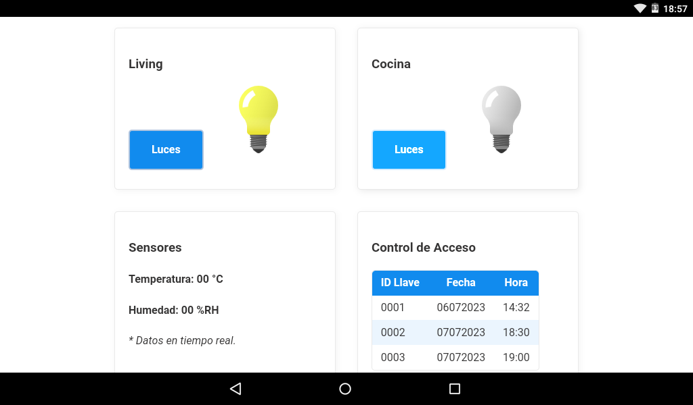
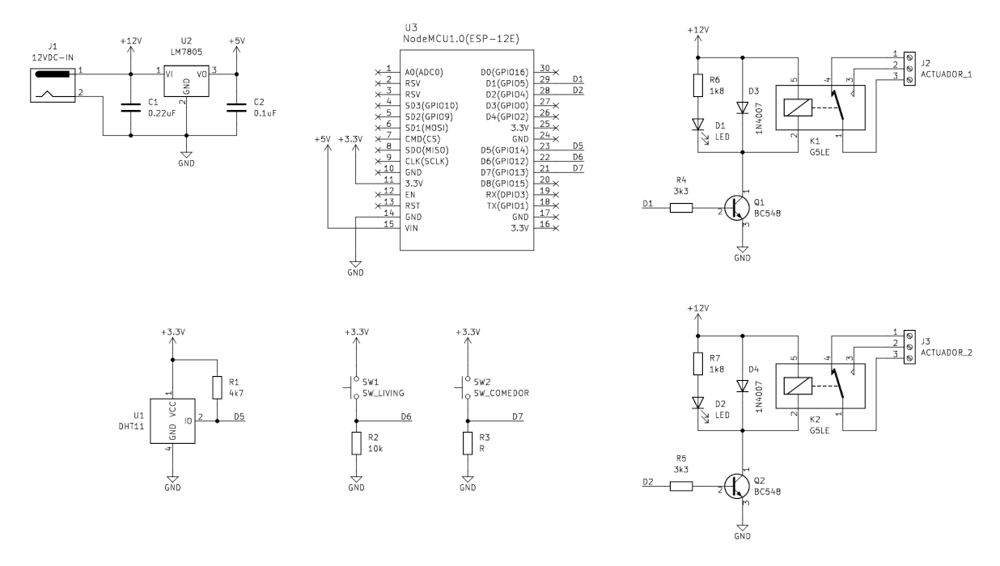

# Demo Domótica

Demo de implementación de tecnologías de software y hardware aplicadas a proyectos de dómotica de bajo costo o con fines educativos.

El sistema domótico esta construido alrede

1. Servidor 
2. Panel Web
3. App para Android
4. Hardware

### Panel web

El panel web está construido alrededor de herramientas libres y con la intención de ser fácil de mantener y simple.

* [MVP.css](https://andybrewer.github.io/mvp/)
* [P5.js](https://p5js.org/es/)
* [Eclipse Paho JS](https://github.com/eclipse/paho.mqtt.javascript)
* [Free Public MQTT Broker](https://www.hivemq.com/public-mqtt-broker/)

### App para Android

MQTT Dashboard v2 es la App que permite conectarse a un broker MQTT, para enviar y recibir mensajes hacia (y desde) una placa ESP8266 o compatible. En la carpeta *apk* ..... Esta diseñada con la herramienta [MIT App Inventor](https://appinventor.mit.edu/).

Changelog:

21/02/2023 Agregada pantalla de configuración de broker y topics.

Extensión:

AI2 MQTT Extension: Sensor Readings back and forth
https://ullisroboterseite.de/android-AI2-PahoMQTT-en.html

Créditos:

Light switch icons created by Superarticons - Flaticon
https://www.flaticon.com/free-icons/light-switch

### Hardware

El firmware está escrito en [MicroPython](http://micropython.org).

## Licencia

Este trabajo está protegido por la **Licencia MIT**. Puedes acceder a la versión original de la licencia (en inglés) a través del archivo [LICENSE](./LICENSE) o en línea en [The MIT License (MIT)](https://mit-license.org/). También proporcionamos una traducción no oficial desde [Wikipedia](https://es.m.wikipedia.org/wiki/Licencia_MIT#La_licencia):

Copyright (c) 2024 Lucas Martín Treser

Por la presente se concede permiso, libre de cargos, a cualquier persona que obtenga una copia de este software y de los archivos de documentación asociados (el "Software"), a utilizar el Software sin restricción, incluyendo sin limitación los derechos a usar, copiar, modificar, fusionar, publicar, distribuir, sublicenciar, y/o vender copias del Software, y a permitir a las personas a las que se les proporcione el Software a hacer lo mismo, sujeto a las siguientes condiciones:

El aviso de copyright anterior y este aviso de permiso se incluirán en todas las copias o partes sustanciales del Software.

EL SOFTWARE SE PROPORCIONA "COMO ESTÁ", SIN GARANTÍA DE NINGÚN TIPO, EXPRESA O IMPLÍCITA, INCLUYENDO PERO NO LIMITADO A GARANTÍAS DE COMERCIALIZACIÓN, IDONEIDAD PARA UN PROPÓSITO PARTICULAR E INCUMPLIMIENTO. EN NINGÚN CASO LOS AUTORES O PROPIETARIOS DE LOS DERECHOS DE AUTOR SERÁN RESPONSABLES DE NINGUNA RECLAMACIÓN, DAÑOS U OTRAS RESPONSABILIDADES, YA SEA EN UNA ACCIÓN DE CONTRATO, AGRAVIO O CUALQUIER OTRO MOTIVO, DERIVADAS DE, FUERA DE O EN CONEXIÓN CON EL SOFTWARE O SU USO U OTRO TIPO DE ACCIONES EN EL SOFTWARE.