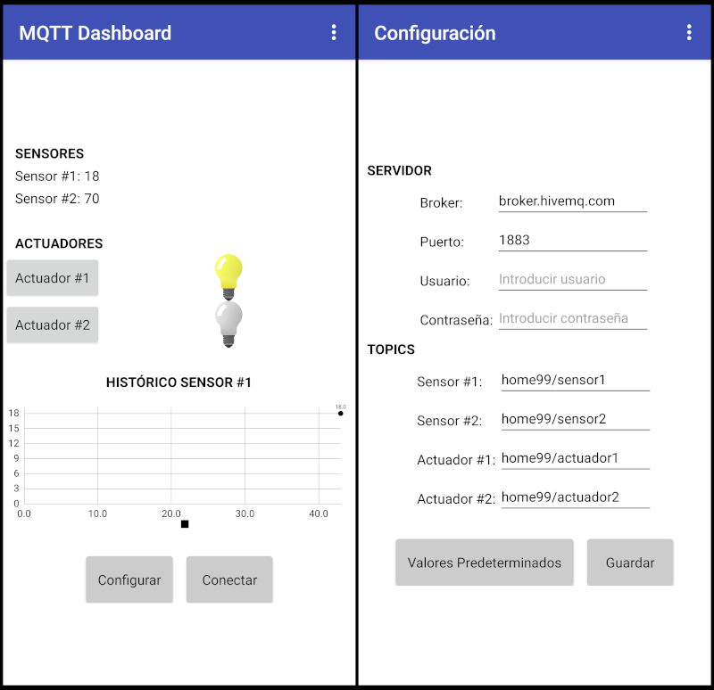

# Demo Domótica

Demo de implementación de tecnologías de software y hardware aplicadas a proyectos de dómotica de bajo costo o con fines educativos. El sistema domótico esta planteando en cuatro componentes:

1. Servidor, broker MQTT 
2. Panel Web
3. App para Android
4. Dispositivo basado en ESP8266

### Servidor MQTT

En este proyecto se utiliza el [Broker MQTT público](https://www.hivemq.com/public-mqtt-broker/) (y gratuito) de la empresa HiveMQ. Se puede acceder de manera segura en:

```sh
Broker: broker.hivemq.com
TCP Port: 1883
Websocket Port: 8000
TLS TCP Port: 8883
TLS Websocket Port: 8884
```

### Panel web

El *panel web* es un cliente local que envia y recibe información al broker MQTT. Está construido alrededor de herramientas libres y con la intención de ser fácil de mantener y simple.

* [MVP.css](https://andybrewer.github.io/mvp/), es una hoja de estilo minimalista para elementos HTML
* [P5.js](https://p5js.org/es/), p5.js es una biblioteca de JavaScript para programación creativa
* [Eclipse Paho JS](https://github.com/eclipse/paho.mqtt.javascript), es una biblioteca cliente escrita en Javascript que utiliza WebSockets para conectarse a un Broker MQTT

El panel está organizado en tarjetas, donde despliega información o permite interactuar con el hardware.


*Panel Web en Android*

### App para Android

**MQTT Dashboard v2** es una aplicación para Android desarrollada con la herramienta [MIT App Inventor](https://appinventor.mit.edu/). Permite conectarse a un broker MQTT, para enviar y recibir mensajes hacia (y desde) una placa ESP8266 o compatible. 



El archivo `./src/apk/MQTT_Dashboard_v2.aia` es el proyecto completo escrito en MIT App Inventor. Necesita las siguientes dependencias:

- [AI2 MQTT Extension: Sensor Readings back and forth](https://ullisroboterseite.de/android-AI2-PahoMQTT-en.html)
- [Light switch icons created by Superarticons - Flaticon](https://www.flaticon.com/free-icons/light-switch)

### Hardware

El hardware, diseñado con la herramienta [KiCad EDA](https://www.kicad.org/), está basado en una placa NodeMCU (que incorpora el SoC ESP8266), dos pulsadores, un sensor de temperatura y humedad ambiente DHT11, y dos relés para manejar potencia. Se puede alimentar con una fuente de pared de 12V.


El ESP8266 en este caso tiene incorporado el interprete de [MicroPython](http://micropython.org), por lo que el firmware está escrito en ese lenguaje. Para poder conectarse a un broker MQTT necesita el módulo `umqttsimple.py`.

## Licencia

Este trabajo está protegido por la **Licencia MIT**. Puedes acceder a la versión original de la licencia (en inglés) a través del archivo [LICENSE](./LICENSE) o en línea en [The MIT License (MIT)](https://mit-license.org/). También proporcionamos una traducción no oficial desde [Wikipedia](https://es.m.wikipedia.org/wiki/Licencia_MIT#La_licencia):

Copyright (c) 2024 Lucas Martín Treser

Por la presente se concede permiso, libre de cargos, a cualquier persona que obtenga una copia de este software y de los archivos de documentación asociados (el "Software"), a utilizar el Software sin restricción, incluyendo sin limitación los derechos a usar, copiar, modificar, fusionar, publicar, distribuir, sublicenciar, y/o vender copias del Software, y a permitir a las personas a las que se les proporcione el Software a hacer lo mismo, sujeto a las siguientes condiciones:

El aviso de copyright anterior y este aviso de permiso se incluirán en todas las copias o partes sustanciales del Software.

EL SOFTWARE SE PROPORCIONA "COMO ESTÁ", SIN GARANTÍA DE NINGÚN TIPO, EXPRESA O IMPLÍCITA, INCLUYENDO PERO NO LIMITADO A GARANTÍAS DE COMERCIALIZACIÓN, IDONEIDAD PARA UN PROPÓSITO PARTICULAR E INCUMPLIMIENTO. EN NINGÚN CASO LOS AUTORES O PROPIETARIOS DE LOS DERECHOS DE AUTOR SERÁN RESPONSABLES DE NINGUNA RECLAMACIÓN, DAÑOS U OTRAS RESPONSABILIDADES, YA SEA EN UNA ACCIÓN DE CONTRATO, AGRAVIO O CUALQUIER OTRO MOTIVO, DERIVADAS DE, FUERA DE O EN CONEXIÓN CON EL SOFTWARE O SU USO U OTRO TIPO DE ACCIONES EN EL SOFTWARE.